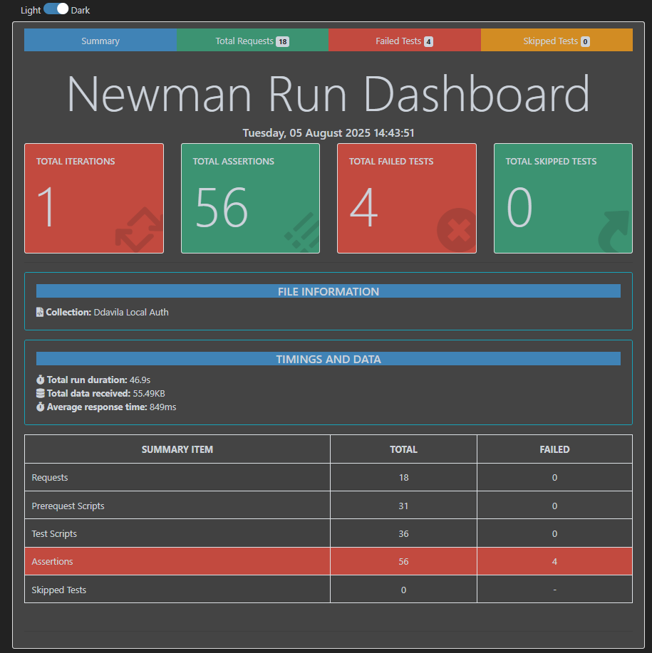

# postmanAPi-cli-Ddavila
API testing collection using Postman and Newman with detailed reports.
## Overview
This repository contains automated API tests for the **Ddavila** project, focusing on **authentication** workflows. Tests are created using **Postman** and executed via **Newman CLI** in GitHub Actions CI pipelines to ensure continuous validation of API endpoints.

---

## Testing Scope

- Authentication endpoints (register, login, logout, OTP verification, Google login, etc.)
- HTTP status code validations (e.g., 200 OK, 401 Unauthorized)
- Dynamic test scripts to verify response structure, tokens, and messages
- Email OTP verification flows via temporary mail service integration

---

## Tools & Technologies

- [Postman](https://www.postman.com/) — API test creation & management  
- [Newman](https://github.com/postmanlabs/newman) — CLI runner for Postman collections  
- [Newman HTML Extra Reporter](https://github.com/DannyDainton/newman-reporter-htmlextra) — Enhanced HTML test reports  
- [GitHub Actions](https://github.com/features/actions) — CI/CD automation for test execution and report publishing

---
## HTML Report Screenshot



*This screenshot shows the detailed test summary, assertions, and response timings from the Newman HTML Extra report.*

---

## HTML Report File Path

After running the tests, the generated HTML report can be found at:


## Test Execution Workflow

- Postman collection tests authentication flows with detailed assertions:
  - Validates HTTP status codes (e.g., 200, 401, 500)
  - Checks response body for success messages, tokens, user info
  - Handles dynamic OTP extraction and validation
- Tests are run automatically on `push` or via manual trigger (`workflow_dispatch`) using Newman CLI in GitHub Actions
- HTML Extra reports are generated and published to GitHub Pages for easy review
- Reports artifacts (including screenshots) are uploaded to GitHub workflow run for download

---

## How to Run Tests Locally

1. Export the Postman collection JSON (`collection.json`) from Postman (authentication tests only)  
2. Install Newman and the HTML Extra reporter:
   ```bash
   npm install -g newman newman-reporter-htmlextra
